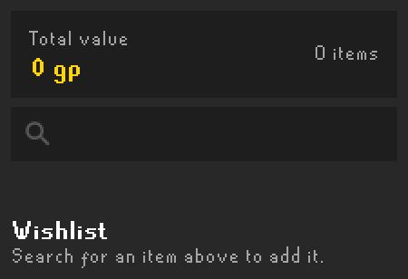
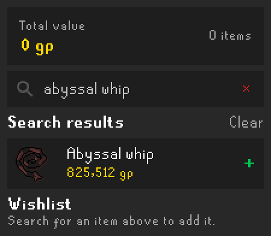
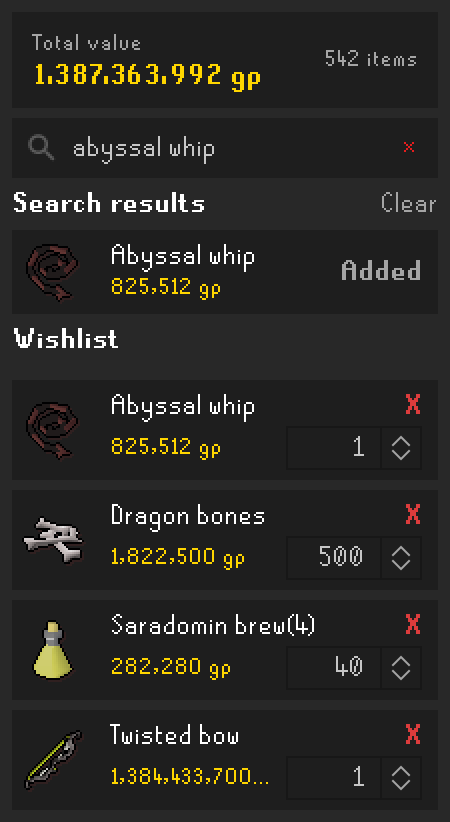

# Item Wishlist

Adds a side panel to the RuneLite client for keeping a wishlist of items.

- Search for any tradeable item by name (press Enter) and click **+** to add it.
- Set how many of each item you want with the quantity box on the right of its wishlist row (defaults to 1).
- Click **X** on a wishlist row to remove it.
- Each row shows its price (unit price × quantity) and the panel shows the combined total of everything on the list.

## Screenshots

**Empty panel** - search for an item to get started:

**Search** - press Enter to search tradeable items by name, then click **+** to add one. The search stays open, so you can add several items from one search:

**Wishlist** - set a quantity for each item, remove items with **X**, and see the combined total at the top. Items already on the list show **Added** in the search results:

## Prices

Prices come from RuneLite's item price data, so they follow the "use actively traded price" setting in RuneLite's
main configuration. The wishlist is saved in your RuneLite settings and persists between sessions.
